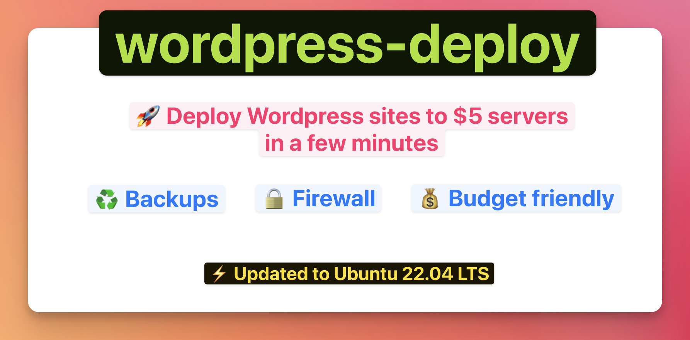
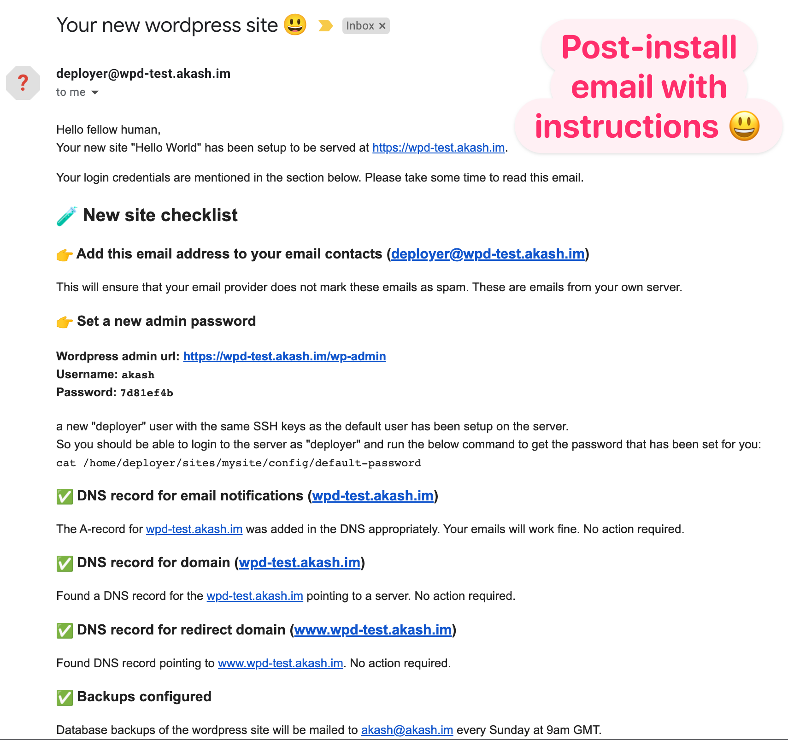

# wordpress-deploy

[Install](#install) | [Deploy a site](#deploy-a-site) | [Configuration options](docs/configuration.md) | [FAQs](docs/faqs.md)



-----

Use this to setup blogs for your family or landing pages for your side-projects. (*Hint: Gutenberg editor Full Site Editing is 🔥*)

* 😍 Easy to configure
* 💰 Budget-friendly setup. Stuff as many sites as you can on your $5 server.
* ♻️ Automated weekly backups by email + daily backups on server ([docs](docs/backups.md))
* 💪 Firewall protection with `ufw`
* ⚡️ Pre-installs [WP Super Cache](https://wordpress.org/plugins/wp-super-cache/) for speed optimization
* 🧪 Tested on [DigitalOcean](https://www.digitalocean.com/)
* ⛑ Wordpress update email alerts *(👨‍💻 Coming soon)*
* 👮‍♀️ Server monitoring with email alerts *(👨‍💻 Coming soon)*

> You still need to enable disk backups with your cloud provider.

## Deploy a site

### [Step-1] Create a server with Ubuntu 22.04 (LTS) on your cloud provider

Ensure to choose SSH key as the authentication method and add the SSH key to your local SSH key agent.

```shell
ssh-add ~/.ssh/mykey
```

### [Step-2] Add DNS records for domain/subdomains

* Domain/subdomain for the website.
* Domain/subdomain for email notifications (backup emails, alerts, etc). Add an A-record for this.

> These two can be the same domain/subdomain.

### [Step-3] Create a configuration file for your site

Download the sample site configuration and edit the values to suite your requirements.

```shell
wget https://raw.githubusercontent.com/HashNuke/wordpress-deploy/main/sites/sample.yml
```

Feel free to rename `sample.yml` to anything else. You even call it `hello.yml` like I do in our examples.

The CNAME of the website should be set as the value of `server` option in the site configuration.

#### [Step-4] Deploy

Our site configuration `hello.yml` is in the current directory, so we use `$(pwd)/hello.yml` to specify the path.

```shell
export WP_SITE_CONFIG=$(pwd)/hello.yml
```

Run the command below as is to begin deployment.

```shell
docker run -t -v $WP_SITE_CONFIG:/site.yml \
-v $SSH_AUTH_SOCK:/ssh-agent -e SSH_AUTH_SOCK=/ssh-agent \
hashnuke/wordpress-deploy:1 setup.yml
```

### 👉 Login credentials + New site checklist 😃

The wordpress admin user will receive an email with login credentials for the admin user. This email also includes a checklist for your new site.

> **[IMPORTANT]** *If you do not find this email in your inbox, please check your spam folder. And if you still do not find it then check the instructions below the screenshot.*



#### Find default password for admin user

If you do not get an email after setting up a new site, then you can still access the password for the admin user. The default password is stored as a file on the server.

Assuming as per configuration, your `site_name` is "mysite" and `deploy_user` is "deployer" (default value), your default wordpress admin password can be found at the following path on the server.

```shell
/home/deployer/sites/mysite/config/default-password
```

## Destroy a site

Assuming your site configuration is `hello.yml` in the current directory.

```shell
export WP_SITE_CONFIG=$(pwd)/hello.yml
```

Run the command below to destroy a site.

```shell
docker run -t -v $WP_SITE_CONFIG:/site.yml \
-v $SSH_AUTH_SOCK:/ssh-agent -e SSH_AUTH_SOCK=/ssh-agent \
hashnuke/wordpress-deploy:1 destroy.yml
```

> *Note the only difference between the setup command and this, is that we call the `destroy.yml` instead of `setup.yml`.*

## Building new images

This is for me or anyone looking to build their own docker image.

```
export IMAGE_NAME=hashnuke/wordpress-deploy:1

# Build the image
docker build . -t $IMAGE_NAME

# Push to docker hub
docker image push $IMAGE_NAME
```

## More documentation

* [Configuration Options](docs/configuration.md)
* [Backups](docs/backups.md)
* [FAQs](docs/faqs.md)

## License

```
Copyright (C) from 2022 till date: Akash Manohar John
Check the LICENSE file for more info.
```
