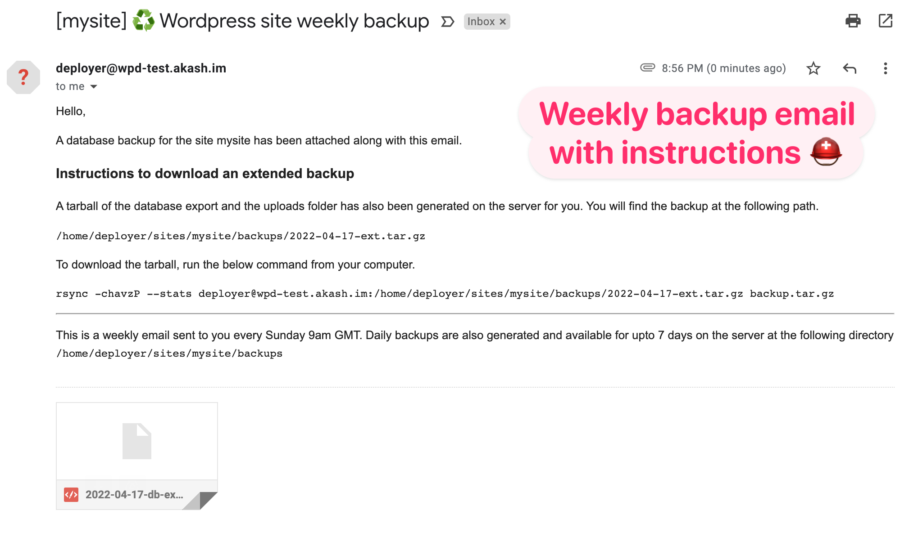

# Backups

## Backups on the server

Backups are generated daily for every site that is deployed.

Two kinds of backups are generated:
* A database export (`.sql` file)
* A tarball (`.tar.gz`) with the database backup and the uploads dir.

Backups older than 7 days are deleted.

#### Location of the backups

If your `site_name` is configured as `mysite`, then the backup for the site can be found at the following directory:

```
/sites/mysite/backups
```

## Backups by email

Every Sunday at 9am GMT, a database backup is mailed to the email address configured as the wordpress admin email. This email also includes instructions about downloading the extended backup.

The backup email looks like below.


